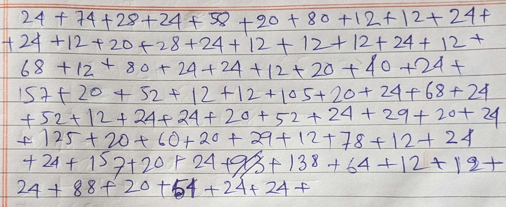

# OCRlator
I have written this script for a practical problem: verify the total bill what your canteen manager is asking. OCRlator (OCR based calculator) can help with that. It is not anywhere near to be perfect but yeah, it will be giving you order-of-magnitude answer given your handwriting is clear. It will expect that you write your daily expanses like in the example image. It is a wrapper around `easyocr` and requires numpy.

*Figure 1: Example image*
